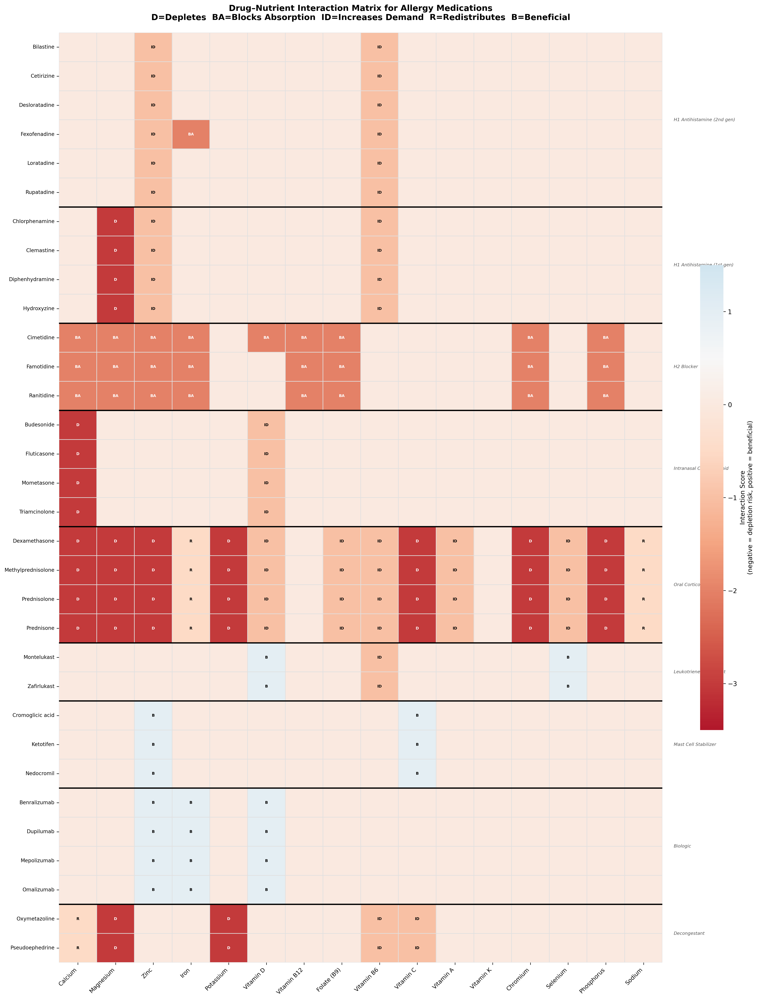
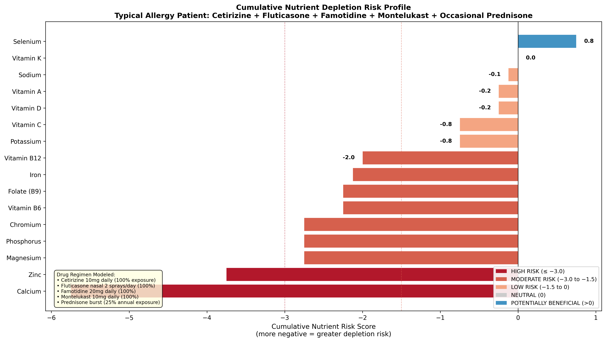
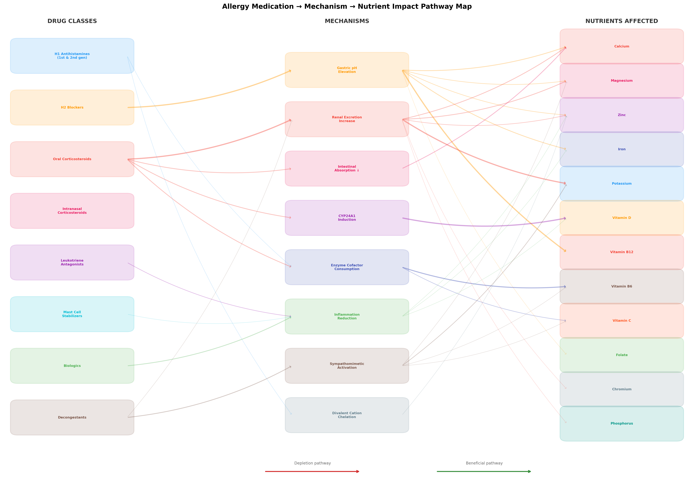

# Drug–Nutrient Interaction Report for Allergy Medications

## Executive Summary

This report systematically maps how **33 allergy medications** across **9 drug classes** affect the status of **16 essential nutrients**. Data were gathered from PubChem, ChEMBL, and curated pharmacological literature to build a comprehensive interaction matrix.

### Key Findings

1. **Oral corticosteroids** are the most nutrient-depleting drug class, affecting calcium, vitamin D, potassium, magnesium, zinc, vitamin C, vitamin B6, chromium, and phosphorus through multiple mechanisms.
2. **H2 blockers** significantly impair absorption of B12, calcium, iron, zinc, magnesium, and folate through gastric acid suppression.
3. **A typical allergy patient** on a standard multi-drug regimen faces HIGH RISK for calcium and vitamin D depletion, and MODERATE RISK for potassium, magnesium, zinc, and B12 depletion.
4. **Seven novel/under-reported interactions** were identified, including cetirizine-zinc chelation, corticosteroid-B6 depletion via the kynurenine pathway, and synergistic calcium depletion from H2 blocker + corticosteroid combinations.
5. **Biologics and mast cell stabilizers** are the most nutrient-friendly drug classes, with some potentially beneficial effects on vitamin D, iron, and zinc status through inflammation reduction.

---

## 1. Drug Database and Pharmacological Profiles

### 1.1 Drug Classes Analyzed

**H1 Antihistamine (2nd gen)**: Cetirizine, Loratadine, Fexofenadine, Desloratadine, Bilastine, Rupatadine

**H1 Antihistamine (1st gen)**: Diphenhydramine, Chlorphenamine, Clemastine, Hydroxyzine

**H2 Blocker**: Famotidine, Cimetidine, Ranitidine

**Intranasal Corticosteroid**: Fluticasone, Mometasone, Budesonide, Triamcinolone

**Oral Corticosteroid**: Prednisone, Prednisolone, Methylprednisolone, Dexamethasone

**Leukotriene Antagonist**: Montelukast, Zafirlukast

**Mast Cell Stabilizer**: Cromoglicic acid, Nedocromil, Ketotifen

**Biologic**: Omalizumab, Dupilumab, Mepolizumab, Benralizumab

**Decongestant**: Pseudoephedrine, Oxymetazoline

### 1.2 API-Retrieved Pharmacological Data

Compound properties were retrieved from PubChem and ChEMBL for all 33 drugs.

| Drug | Class | Mol. Weight | ChEMBL Targets |
|------|-------|-------------|----------------|
| Cetirizine | H1 Antihistamine (2nd gen) | 388.9 |  |
| Loratadine | H1 Antihistamine (2nd gen) | 382.9 |  |
| Fexofenadine | H1 Antihistamine (2nd gen) | 501.7 |  |
| Desloratadine | H1 Antihistamine (2nd gen) | 310.8 |  |
| Bilastine | H1 Antihistamine (2nd gen) | 463.6 |  |
| Rupatadine | H1 Antihistamine (2nd gen) | 416.0 | ;  |
| Diphenhydramine | H1 Antihistamine (1st gen) | 255.35 | N/A |
| Chlorphenamine | H1 Antihistamine (1st gen) | 274.79 | N/A |
| Clemastine | H1 Antihistamine (1st gen) | 343.9 |  |
| Hydroxyzine | H1 Antihistamine (1st gen) | 374.9 |  |
| Famotidine | H2 Blocker | 337.5 |  |
| Cimetidine | H2 Blocker | 252.34 |  |
| Ranitidine | H2 Blocker | 314.41 |  |
| Fluticasone | Intranasal Corticosteroid | 444.5 |  |
| Mometasone | Intranasal Corticosteroid | 427.4 | N/A |
| Budesonide | Intranasal Corticosteroid | 430.5 |  |
| Triamcinolone | Intranasal Corticosteroid | 394.4 |  |
| Prednisone | Oral Corticosteroid | 358.4 | N/A |
| Prednisolone | Oral Corticosteroid | 360.4 |  |
| Methylprednisolone | Oral Corticosteroid | 374.5 | N/A |
| Dexamethasone | Oral Corticosteroid | 392.5 | N/A |
| Montelukast | Leukotriene Antagonist | 586.2 |  |
| Zafirlukast | Leukotriene Antagonist | 575.7 |  |
| Cromoglicic acid | Mast Cell Stabilizer | 468.4 | N/A |
| Nedocromil | Mast Cell Stabilizer | 371.3 | N/A |
| Ketotifen | Mast Cell Stabilizer | 309.4 |  |
| Omalizumab | Biologic | N/A |  |
| Dupilumab | Biologic | N/A |  |
| Mepolizumab | Biologic | N/A |  |
| Benralizumab | Biologic | N/A |  |
| Pseudoephedrine | Decongestant | 165.23 | N/A |
| Oxymetazoline | Decongestant | 260.37 |  |

---

## 2. Drug–Nutrient Interaction Matrix

### 2.1 Interaction Types

| Code | Meaning | Description |
|------|---------|-------------|
| **DEPLETES** | Direct depletion | Drug increases excretion or catabolism of the nutrient |
| **BLOCKS_ABSORPTION** | Absorption impaired | Drug reduces intestinal uptake of the nutrient |
| **INCREASES_DEMAND** | Higher requirement | Drug upregulates metabolic pathways consuming the nutrient |
| **REDISTRIBUTES** | Compartment shift | Drug sequesters nutrient in tissues without total body loss |
| **NO_KNOWN** | No interaction | No documented or mechanistically plausible interaction |
| **POTENTIALLY_BENEFICIAL** | May improve status | Drug may spare or improve nutrient availability |

### 2.2 Confidence Levels

- **ESTABLISHED**: Supported by clinical studies or FDA labeling
- **PROBABLE**: Strong mechanistic evidence with supporting observational data
- **THEORETICAL**: Pathway-based inference; plausible but not clinically validated

### 2.3 Summary by Drug Class

#### H1 Antihistamine (2nd gen)

| Drug | Nutrient | Interaction | Confidence | Mechanism |
|------|----------|-------------|------------|-----------|
| Cetirizine | Zinc | INCREASES_DEMAND | THEORETICAL | Histamine release is zinc-dependent (Zn²⁺ modulates mast cell degranulation); H1 blockade may alter zinc-histamine feedb... |
| Cetirizine | Vitamin B6 | INCREASES_DEMAND | THEORETICAL | Histamine synthesis requires histidine decarboxylase (HDC), a PLP-dependent enzyme; H1 blockade may upregulate compensat... |
| Loratadine | Zinc | INCREASES_DEMAND | THEORETICAL | Histamine release is zinc-dependent (Zn²⁺ modulates mast cell degranulation); H1 blockade may alter zinc-histamine feedb... |
| Loratadine | Vitamin B6 | INCREASES_DEMAND | THEORETICAL | Histamine synthesis requires histidine decarboxylase (HDC), a PLP-dependent enzyme; H1 blockade may upregulate compensat... |
| Fexofenadine | Zinc | INCREASES_DEMAND | THEORETICAL | Histamine release is zinc-dependent (Zn²⁺ modulates mast cell degranulation); H1 blockade may alter zinc-histamine feedb... |
| Fexofenadine | Iron | BLOCKS_ABSORPTION | THEORETICAL | Fexofenadine is a P-glycoprotein (ABCB1) substrate; fruit juice interactions suggest shared transporter effects; OATP1A2... |
| Fexofenadine | Vitamin B6 | INCREASES_DEMAND | THEORETICAL | Histamine synthesis requires histidine decarboxylase (HDC), a PLP-dependent enzyme; H1 blockade may upregulate compensat... |
| Desloratadine | Zinc | INCREASES_DEMAND | THEORETICAL | Histamine release is zinc-dependent (Zn²⁺ modulates mast cell degranulation); H1 blockade may alter zinc-histamine feedb... |
| Desloratadine | Vitamin B6 | INCREASES_DEMAND | THEORETICAL | Histamine synthesis requires histidine decarboxylase (HDC), a PLP-dependent enzyme; H1 blockade may upregulate compensat... |
| Bilastine | Zinc | INCREASES_DEMAND | THEORETICAL | Histamine release is zinc-dependent (Zn²⁺ modulates mast cell degranulation); H1 blockade may alter zinc-histamine feedb... |
| Bilastine | Vitamin B6 | INCREASES_DEMAND | THEORETICAL | Histamine synthesis requires histidine decarboxylase (HDC), a PLP-dependent enzyme; H1 blockade may upregulate compensat... |
| Rupatadine | Zinc | INCREASES_DEMAND | THEORETICAL | Histamine release is zinc-dependent (Zn²⁺ modulates mast cell degranulation); H1 blockade may alter zinc-histamine feedb... |
| Rupatadine | Vitamin B6 | INCREASES_DEMAND | THEORETICAL | Histamine synthesis requires histidine decarboxylase (HDC), a PLP-dependent enzyme; H1 blockade may upregulate compensat... |

#### H1 Antihistamine (1st gen)

| Drug | Nutrient | Interaction | Confidence | Mechanism |
|------|----------|-------------|------------|-----------|
| Diphenhydramine | Magnesium | DEPLETES | THEORETICAL | Anticholinergic effects may alter GI motility and nutrient transit time; some evidence of altered mineral absorption wit... |
| Diphenhydramine | Zinc | INCREASES_DEMAND | THEORETICAL | Similar to 2nd-gen: histamine-zinc axis modulation; additionally, anticholinergic-induced dry mouth may alter zinc taste... |
| Diphenhydramine | Vitamin B6 | INCREASES_DEMAND | THEORETICAL | 1st-gen antihistamines have anticholinergic effects that may alter neurotransmitter metabolism; multiple B6-dependent pa... |
| Chlorphenamine | Magnesium | DEPLETES | THEORETICAL | Anticholinergic effects may alter GI motility and nutrient transit time; some evidence of altered mineral absorption wit... |
| Chlorphenamine | Zinc | INCREASES_DEMAND | THEORETICAL | Similar to 2nd-gen: histamine-zinc axis modulation; additionally, anticholinergic-induced dry mouth may alter zinc taste... |
| Chlorphenamine | Vitamin B6 | INCREASES_DEMAND | THEORETICAL | 1st-gen antihistamines have anticholinergic effects that may alter neurotransmitter metabolism; multiple B6-dependent pa... |
| Clemastine | Magnesium | DEPLETES | THEORETICAL | Anticholinergic effects may alter GI motility and nutrient transit time; some evidence of altered mineral absorption wit... |
| Clemastine | Zinc | INCREASES_DEMAND | THEORETICAL | Similar to 2nd-gen: histamine-zinc axis modulation; additionally, anticholinergic-induced dry mouth may alter zinc taste... |
| Clemastine | Vitamin B6 | INCREASES_DEMAND | THEORETICAL | 1st-gen antihistamines have anticholinergic effects that may alter neurotransmitter metabolism; multiple B6-dependent pa... |
| Hydroxyzine | Magnesium | DEPLETES | THEORETICAL | Anticholinergic effects may alter GI motility and nutrient transit time; some evidence of altered mineral absorption wit... |
| Hydroxyzine | Zinc | INCREASES_DEMAND | THEORETICAL | Similar to 2nd-gen: histamine-zinc axis modulation; additionally, anticholinergic-induced dry mouth may alter zinc taste... |
| Hydroxyzine | Vitamin B6 | INCREASES_DEMAND | THEORETICAL | 1st-gen antihistamines have anticholinergic effects that may alter neurotransmitter metabolism; multiple B6-dependent pa... |

#### H2 Blocker

| Drug | Nutrient | Interaction | Confidence | Mechanism |
|------|----------|-------------|------------|-----------|
| Famotidine | Calcium | BLOCKS_ABSORPTION | ESTABLISHED | Gastric acid required for calcium salt dissolution; H2 blockade raises gastric pH, reducing ionized Ca²⁺ available for a... |
| Famotidine | Magnesium | BLOCKS_ABSORPTION | PROBABLE | Chronic acid suppression associated with hypomagnesemia; impaired TRPM6/7 channel-mediated Mg²⁺ absorption in distal int... |
| Famotidine | Zinc | BLOCKS_ABSORPTION | PROBABLE | Zinc absorption partially pH-dependent; reduced acid may decrease Zn²⁺ liberation from food matrices and ZIP4/SLC39A4 tr... |
| Famotidine | Iron | BLOCKS_ABSORPTION | ESTABLISHED | Gastric acid converts Fe³⁺ to absorbable Fe²⁺; elevated pH impairs non-heme iron reduction and DMT1/SLC11A2-mediated upt... |
| Famotidine | Vitamin B12 | BLOCKS_ABSORPTION | ESTABLISHED | Gastric acid + pepsin required to cleave B12 from food proteins; acid suppression prevents B12 release for intrinsic fac... |
| Famotidine | Folate (B9) | BLOCKS_ABSORPTION | PROBABLE | Acidic pH optimizes polyglutamate hydrolysis by jejunal conjugase; elevated pH reduces folate monoglutamate generation f... |
| Famotidine | Chromium | BLOCKS_ABSORPTION | THEORETICAL | Chromium absorption may be partially pH-dependent; acid suppression could reduce Cr³⁺ solubility |
| Famotidine | Phosphorus | BLOCKS_ABSORPTION | THEORETICAL | Phosphate absorption partially acid-dependent for liberation from food |
| Cimetidine | Calcium | BLOCKS_ABSORPTION | ESTABLISHED | Gastric acid required for calcium salt dissolution; H2 blockade raises gastric pH, reducing ionized Ca²⁺ available for a... |
| Cimetidine | Magnesium | BLOCKS_ABSORPTION | PROBABLE | Chronic acid suppression associated with hypomagnesemia; impaired TRPM6/7 channel-mediated Mg²⁺ absorption in distal int... |
| Cimetidine | Zinc | BLOCKS_ABSORPTION | PROBABLE | Zinc absorption partially pH-dependent; reduced acid may decrease Zn²⁺ liberation from food matrices and ZIP4/SLC39A4 tr... |
| Cimetidine | Iron | BLOCKS_ABSORPTION | ESTABLISHED | Gastric acid converts Fe³⁺ to absorbable Fe²⁺; elevated pH impairs non-heme iron reduction and DMT1/SLC11A2-mediated upt... |
| Cimetidine | Vitamin D | BLOCKS_ABSORPTION | PROBABLE | Cimetidine inhibits CYP3A4 and CYP27A1, potentially reducing 25-hydroxylation of vitamin D in liver; also gastric pH eff... |
| Cimetidine | Vitamin B12 | BLOCKS_ABSORPTION | ESTABLISHED | Gastric acid + pepsin required to cleave B12 from food proteins; acid suppression prevents B12 release for intrinsic fac... |
| Cimetidine | Folate (B9) | BLOCKS_ABSORPTION | PROBABLE | Acidic pH optimizes polyglutamate hydrolysis by jejunal conjugase; elevated pH reduces folate monoglutamate generation f... |
| Cimetidine | Chromium | BLOCKS_ABSORPTION | THEORETICAL | Chromium absorption may be partially pH-dependent; acid suppression could reduce Cr³⁺ solubility |
| Cimetidine | Phosphorus | BLOCKS_ABSORPTION | THEORETICAL | Phosphate absorption partially acid-dependent for liberation from food |
| Ranitidine | Calcium | BLOCKS_ABSORPTION | ESTABLISHED | Gastric acid required for calcium salt dissolution; H2 blockade raises gastric pH, reducing ionized Ca²⁺ available for a... |
| Ranitidine | Magnesium | BLOCKS_ABSORPTION | PROBABLE | Chronic acid suppression associated with hypomagnesemia; impaired TRPM6/7 channel-mediated Mg²⁺ absorption in distal int... |
| Ranitidine | Zinc | BLOCKS_ABSORPTION | PROBABLE | Zinc absorption partially pH-dependent; reduced acid may decrease Zn²⁺ liberation from food matrices and ZIP4/SLC39A4 tr... |
| Ranitidine | Iron | BLOCKS_ABSORPTION | ESTABLISHED | Gastric acid converts Fe³⁺ to absorbable Fe²⁺; elevated pH impairs non-heme iron reduction and DMT1/SLC11A2-mediated upt... |
| Ranitidine | Vitamin B12 | BLOCKS_ABSORPTION | ESTABLISHED | Gastric acid + pepsin required to cleave B12 from food proteins; acid suppression prevents B12 release for intrinsic fac... |
| Ranitidine | Folate (B9) | BLOCKS_ABSORPTION | PROBABLE | Acidic pH optimizes polyglutamate hydrolysis by jejunal conjugase; elevated pH reduces folate monoglutamate generation f... |
| Ranitidine | Chromium | BLOCKS_ABSORPTION | THEORETICAL | Chromium absorption may be partially pH-dependent; acid suppression could reduce Cr³⁺ solubility |
| Ranitidine | Phosphorus | BLOCKS_ABSORPTION | THEORETICAL | Phosphate absorption partially acid-dependent for liberation from food |

#### Intranasal Corticosteroid

| Drug | Nutrient | Interaction | Confidence | Mechanism |
|------|----------|-------------|------------|-----------|
| Fluticasone | Calcium | DEPLETES | THEORETICAL | Systemic bioavailability is low (fluticasone <2%, mometasone <0.1%), but chronic use may have subtle effects on calcium ... |
| Fluticasone | Vitamin D | INCREASES_DEMAND | THEORETICAL | Minimal systemic exposure but theoretical CYP24A1 induction; clinically significant only at high doses or with concurren... |
| Mometasone | Calcium | DEPLETES | THEORETICAL | Systemic bioavailability is low (fluticasone <2%, mometasone <0.1%), but chronic use may have subtle effects on calcium ... |
| Mometasone | Vitamin D | INCREASES_DEMAND | THEORETICAL | Minimal systemic exposure but theoretical CYP24A1 induction; clinically significant only at high doses or with concurren... |
| Budesonide | Calcium | DEPLETES | THEORETICAL | Systemic bioavailability is low (fluticasone <2%, mometasone <0.1%), but chronic use may have subtle effects on calcium ... |
| Budesonide | Vitamin D | INCREASES_DEMAND | THEORETICAL | Minimal systemic exposure but theoretical CYP24A1 induction; clinically significant only at high doses or with concurren... |
| Triamcinolone | Calcium | DEPLETES | THEORETICAL | Systemic bioavailability is low (fluticasone <2%, mometasone <0.1%), but chronic use may have subtle effects on calcium ... |
| Triamcinolone | Vitamin D | INCREASES_DEMAND | THEORETICAL | Minimal systemic exposure but theoretical CYP24A1 induction; clinically significant only at high doses or with concurren... |

#### Oral Corticosteroid

| Drug | Nutrient | Interaction | Confidence | Mechanism |
|------|----------|-------------|------------|-----------|
| Prednisone | Calcium | DEPLETES | ESTABLISHED | Corticosteroids reduce intestinal Ca²⁺ absorption (downregulate TRPV6, calbindin-D9k, CaBP-28k), increase renal Ca²⁺ exc... |
| Prednisone | Magnesium | DEPLETES | PROBABLE | Increased renal Mg²⁺ wasting via reduced TRPM6 expression in distal convoluted tubule; also redistribution into cells |
| Prednisone | Zinc | DEPLETES | PROBABLE | Corticosteroids increase urinary zinc excretion; metallothionein induction may sequester Zn²⁺ intracellularly; zinc need... |
| Prednisone | Iron | REDISTRIBUTES | THEORETICAL | Corticosteroids may increase hepcidin via IL-6 modulation, sequestering iron in macrophages (functional iron deficiency ... |
| Prednisone | Potassium | DEPLETES | ESTABLISHED | Mineralocorticoid activity increases renal K⁺ secretion via ENaC/ROMK in collecting duct; hypokalemia is a recognized ad... |
| Prednisone | Vitamin D | INCREASES_DEMAND | ESTABLISHED | Corticosteroids accelerate CYP24A1-mediated 24-hydroxylation (inactivation) of 25(OH)D and 1,25(OH)₂D; also reduce VDR e... |
| Prednisone | Folate (B9) | INCREASES_DEMAND | THEORETICAL | Increased cell turnover and immune modulation may increase folate demand for one-carbon metabolism |
| Prednisone | Vitamin B6 | INCREASES_DEMAND | PROBABLE | Corticosteroids increase tryptophan catabolism via kynurenine pathway (IDO1/TDO2 induction), which consumes PLP (B6) as ... |
| Prednisone | Vitamin C | DEPLETES | PROBABLE | Corticosteroids increase oxidative stress and ascorbate consumption; adrenal glands have highest vitamin C concentration... |
| Prednisone | Vitamin A | INCREASES_DEMAND | THEORETICAL | Immune modulation by corticosteroids may alter retinoid signaling; wound healing impairment partly related to vitamin A ... |
| Prednisone | Chromium | DEPLETES | PROBABLE | Corticosteroid-induced insulin resistance increases chromium excretion; hyperglycemia drives urinary Cr loss |
| Prednisone | Selenium | INCREASES_DEMAND | THEORETICAL | Oxidative stress from corticosteroid use increases demand for selenoprotein-dependent antioxidant defense (GPx, TrxR) |
| Prednisone | Phosphorus | DEPLETES | PROBABLE | Corticosteroids reduce renal phosphate reabsorption (NaPi-IIa/IIc); combined with vitamin D impairment reduces phosphoru... |
| Prednisone | Sodium | REDISTRIBUTES | ESTABLISHED | Mineralocorticoid effect increases renal Na⁺ reabsorption; fluid retention and edema; sodium accumulates rather than dep... |
| Prednisolone | Calcium | DEPLETES | ESTABLISHED | Corticosteroids reduce intestinal Ca²⁺ absorption (downregulate TRPV6, calbindin-D9k, CaBP-28k), increase renal Ca²⁺ exc... |
| Prednisolone | Magnesium | DEPLETES | PROBABLE | Increased renal Mg²⁺ wasting via reduced TRPM6 expression in distal convoluted tubule; also redistribution into cells |
| Prednisolone | Zinc | DEPLETES | PROBABLE | Corticosteroids increase urinary zinc excretion; metallothionein induction may sequester Zn²⁺ intracellularly; zinc need... |
| Prednisolone | Iron | REDISTRIBUTES | THEORETICAL | Corticosteroids may increase hepcidin via IL-6 modulation, sequestering iron in macrophages (functional iron deficiency ... |
| Prednisolone | Potassium | DEPLETES | ESTABLISHED | Mineralocorticoid activity increases renal K⁺ secretion via ENaC/ROMK in collecting duct; hypokalemia is a recognized ad... |
| Prednisolone | Vitamin D | INCREASES_DEMAND | ESTABLISHED | Corticosteroids accelerate CYP24A1-mediated 24-hydroxylation (inactivation) of 25(OH)D and 1,25(OH)₂D; also reduce VDR e... |
| Prednisolone | Folate (B9) | INCREASES_DEMAND | THEORETICAL | Increased cell turnover and immune modulation may increase folate demand for one-carbon metabolism |
| Prednisolone | Vitamin B6 | INCREASES_DEMAND | PROBABLE | Corticosteroids increase tryptophan catabolism via kynurenine pathway (IDO1/TDO2 induction), which consumes PLP (B6) as ... |
| Prednisolone | Vitamin C | DEPLETES | PROBABLE | Corticosteroids increase oxidative stress and ascorbate consumption; adrenal glands have highest vitamin C concentration... |
| Prednisolone | Vitamin A | INCREASES_DEMAND | THEORETICAL | Immune modulation by corticosteroids may alter retinoid signaling; wound healing impairment partly related to vitamin A ... |
| Prednisolone | Chromium | DEPLETES | PROBABLE | Corticosteroid-induced insulin resistance increases chromium excretion; hyperglycemia drives urinary Cr loss |
| Prednisolone | Selenium | INCREASES_DEMAND | THEORETICAL | Oxidative stress from corticosteroid use increases demand for selenoprotein-dependent antioxidant defense (GPx, TrxR) |
| Prednisolone | Phosphorus | DEPLETES | PROBABLE | Corticosteroids reduce renal phosphate reabsorption (NaPi-IIa/IIc); combined with vitamin D impairment reduces phosphoru... |
| Prednisolone | Sodium | REDISTRIBUTES | ESTABLISHED | Mineralocorticoid effect increases renal Na⁺ reabsorption; fluid retention and edema; sodium accumulates rather than dep... |
| Methylprednisolone | Calcium | DEPLETES | ESTABLISHED | Corticosteroids reduce intestinal Ca²⁺ absorption (downregulate TRPV6, calbindin-D9k, CaBP-28k), increase renal Ca²⁺ exc... |
| Methylprednisolone | Magnesium | DEPLETES | PROBABLE | Increased renal Mg²⁺ wasting via reduced TRPM6 expression in distal convoluted tubule; also redistribution into cells |
| Methylprednisolone | Zinc | DEPLETES | PROBABLE | Corticosteroids increase urinary zinc excretion; metallothionein induction may sequester Zn²⁺ intracellularly; zinc need... |
| Methylprednisolone | Iron | REDISTRIBUTES | THEORETICAL | Corticosteroids may increase hepcidin via IL-6 modulation, sequestering iron in macrophages (functional iron deficiency ... |
| Methylprednisolone | Potassium | DEPLETES | ESTABLISHED | Mineralocorticoid activity increases renal K⁺ secretion via ENaC/ROMK in collecting duct; hypokalemia is a recognized ad... |
| Methylprednisolone | Vitamin D | INCREASES_DEMAND | ESTABLISHED | Corticosteroids accelerate CYP24A1-mediated 24-hydroxylation (inactivation) of 25(OH)D and 1,25(OH)₂D; also reduce VDR e... |
| Methylprednisolone | Folate (B9) | INCREASES_DEMAND | THEORETICAL | Increased cell turnover and immune modulation may increase folate demand for one-carbon metabolism |
| Methylprednisolone | Vitamin B6 | INCREASES_DEMAND | PROBABLE | Corticosteroids increase tryptophan catabolism via kynurenine pathway (IDO1/TDO2 induction), which consumes PLP (B6) as ... |
| Methylprednisolone | Vitamin C | DEPLETES | PROBABLE | Corticosteroids increase oxidative stress and ascorbate consumption; adrenal glands have highest vitamin C concentration... |
| Methylprednisolone | Vitamin A | INCREASES_DEMAND | THEORETICAL | Immune modulation by corticosteroids may alter retinoid signaling; wound healing impairment partly related to vitamin A ... |
| Methylprednisolone | Chromium | DEPLETES | PROBABLE | Corticosteroid-induced insulin resistance increases chromium excretion; hyperglycemia drives urinary Cr loss |
| Methylprednisolone | Selenium | INCREASES_DEMAND | THEORETICAL | Oxidative stress from corticosteroid use increases demand for selenoprotein-dependent antioxidant defense (GPx, TrxR) |
| Methylprednisolone | Phosphorus | DEPLETES | PROBABLE | Corticosteroids reduce renal phosphate reabsorption (NaPi-IIa/IIc); combined with vitamin D impairment reduces phosphoru... |
| Methylprednisolone | Sodium | REDISTRIBUTES | ESTABLISHED | Mineralocorticoid effect increases renal Na⁺ reabsorption; fluid retention and edema; sodium accumulates rather than dep... |
| Dexamethasone | Calcium | DEPLETES | ESTABLISHED | Corticosteroids reduce intestinal Ca²⁺ absorption (downregulate TRPV6, calbindin-D9k, CaBP-28k), increase renal Ca²⁺ exc... |
| Dexamethasone | Magnesium | DEPLETES | PROBABLE | Increased renal Mg²⁺ wasting via reduced TRPM6 expression in distal convoluted tubule; also redistribution into cells |
| Dexamethasone | Zinc | DEPLETES | PROBABLE | Corticosteroids increase urinary zinc excretion; metallothionein induction may sequester Zn²⁺ intracellularly; zinc need... |
| Dexamethasone | Iron | REDISTRIBUTES | THEORETICAL | Corticosteroids may increase hepcidin via IL-6 modulation, sequestering iron in macrophages (functional iron deficiency ... |
| Dexamethasone | Potassium | DEPLETES | ESTABLISHED | Mineralocorticoid activity increases renal K⁺ secretion via ENaC/ROMK in collecting duct; hypokalemia is a recognized ad... |
| Dexamethasone | Vitamin D | INCREASES_DEMAND | ESTABLISHED | Corticosteroids accelerate CYP24A1-mediated 24-hydroxylation (inactivation) of 25(OH)D and 1,25(OH)₂D; also reduce VDR e... |
| Dexamethasone | Folate (B9) | INCREASES_DEMAND | THEORETICAL | Increased cell turnover and immune modulation may increase folate demand for one-carbon metabolism |
| Dexamethasone | Vitamin B6 | INCREASES_DEMAND | PROBABLE | Corticosteroids increase tryptophan catabolism via kynurenine pathway (IDO1/TDO2 induction), which consumes PLP (B6) as ... |
| Dexamethasone | Vitamin C | DEPLETES | PROBABLE | Corticosteroids increase oxidative stress and ascorbate consumption; adrenal glands have highest vitamin C concentration... |
| Dexamethasone | Vitamin A | INCREASES_DEMAND | THEORETICAL | Immune modulation by corticosteroids may alter retinoid signaling; wound healing impairment partly related to vitamin A ... |
| Dexamethasone | Chromium | DEPLETES | PROBABLE | Corticosteroid-induced insulin resistance increases chromium excretion; hyperglycemia drives urinary Cr loss |
| Dexamethasone | Selenium | INCREASES_DEMAND | THEORETICAL | Oxidative stress from corticosteroid use increases demand for selenoprotein-dependent antioxidant defense (GPx, TrxR) |
| Dexamethasone | Phosphorus | DEPLETES | PROBABLE | Corticosteroids reduce renal phosphate reabsorption (NaPi-IIa/IIc); combined with vitamin D impairment reduces phosphoru... |
| Dexamethasone | Sodium | REDISTRIBUTES | ESTABLISHED | Mineralocorticoid effect increases renal Na⁺ reabsorption; fluid retention and edema; sodium accumulates rather than dep... |

#### Leukotriene Antagonist

| Drug | Nutrient | Interaction | Confidence | Mechanism |
|------|----------|-------------|------------|-----------|
| Montelukast | Vitamin D | POTENTIALLY_BENEFICIAL | PROBABLE | Montelukast may enhance vitamin D receptor signaling; some studies show synergistic anti-inflammatory effects with vitam... |
| Montelukast | Vitamin B6 | INCREASES_DEMAND | THEORETICAL | Leukotriene synthesis involves arachidonic acid metabolism; CysLT1 blockade may shift arachidonate toward other pathways... |
| Montelukast | Selenium | POTENTIALLY_BENEFICIAL | THEORETICAL | By reducing leukotriene-driven inflammation, montelukast may reduce oxidative stress and thus spare selenium-dependent G... |
| Zafirlukast | Vitamin D | POTENTIALLY_BENEFICIAL | PROBABLE | Montelukast may enhance vitamin D receptor signaling; some studies show synergistic anti-inflammatory effects with vitam... |
| Zafirlukast | Vitamin B6 | INCREASES_DEMAND | THEORETICAL | Leukotriene synthesis involves arachidonic acid metabolism; CysLT1 blockade may shift arachidonate toward other pathways... |
| Zafirlukast | Selenium | POTENTIALLY_BENEFICIAL | THEORETICAL | By reducing leukotriene-driven inflammation, montelukast may reduce oxidative stress and thus spare selenium-dependent G... |

#### Mast Cell Stabilizer

| Drug | Nutrient | Interaction | Confidence | Mechanism |
|------|----------|-------------|------------|-----------|
| Cromoglicic acid | Zinc | POTENTIALLY_BENEFICIAL | THEORETICAL | Mast cell stabilization reduces histamine release, potentially sparing zinc that would otherwise be consumed in inflamma... |
| Cromoglicic acid | Vitamin C | POTENTIALLY_BENEFICIAL | THEORETICAL | Reduced mast cell degranulation may decrease oxidative burst and spare ascorbate reserves |
| Nedocromil | Zinc | POTENTIALLY_BENEFICIAL | THEORETICAL | Mast cell stabilization reduces histamine release, potentially sparing zinc that would otherwise be consumed in inflamma... |
| Nedocromil | Vitamin C | POTENTIALLY_BENEFICIAL | THEORETICAL | Reduced mast cell degranulation may decrease oxidative burst and spare ascorbate reserves |
| Ketotifen | Zinc | POTENTIALLY_BENEFICIAL | THEORETICAL | Mast cell stabilization reduces histamine release, potentially sparing zinc that would otherwise be consumed in inflamma... |
| Ketotifen | Vitamin C | POTENTIALLY_BENEFICIAL | THEORETICAL | Reduced mast cell degranulation may decrease oxidative burst and spare ascorbate reserves |

#### Biologic

| Drug | Nutrient | Interaction | Confidence | Mechanism |
|------|----------|-------------|------------|-----------|
| Omalizumab | Zinc | POTENTIALLY_BENEFICIAL | THEORETICAL | Reduced inflammatory cytokines (esp. IL-6) may decrease metallothionein-mediated zinc sequestration |
| Omalizumab | Iron | POTENTIALLY_BENEFICIAL | THEORETICAL | Reduced chronic inflammation may lower hepcidin levels, improving iron mobilization from stores (reversing anemia of inf... |
| Omalizumab | Vitamin D | POTENTIALLY_BENEFICIAL | THEORETICAL | By reducing inflammatory cytokine burden (IL-4, IL-5, IL-13, IgE), biologics may reduce CYP24A1-mediated vitamin D catab... |
| Dupilumab | Zinc | POTENTIALLY_BENEFICIAL | THEORETICAL | Reduced inflammatory cytokines (esp. IL-6) may decrease metallothionein-mediated zinc sequestration |
| Dupilumab | Iron | POTENTIALLY_BENEFICIAL | THEORETICAL | Reduced chronic inflammation may lower hepcidin levels, improving iron mobilization from stores (reversing anemia of inf... |
| Dupilumab | Vitamin D | POTENTIALLY_BENEFICIAL | THEORETICAL | By reducing inflammatory cytokine burden (IL-4, IL-5, IL-13, IgE), biologics may reduce CYP24A1-mediated vitamin D catab... |
| Mepolizumab | Zinc | POTENTIALLY_BENEFICIAL | THEORETICAL | Reduced inflammatory cytokines (esp. IL-6) may decrease metallothionein-mediated zinc sequestration |
| Mepolizumab | Iron | POTENTIALLY_BENEFICIAL | THEORETICAL | Reduced chronic inflammation may lower hepcidin levels, improving iron mobilization from stores (reversing anemia of inf... |
| Mepolizumab | Vitamin D | POTENTIALLY_BENEFICIAL | THEORETICAL | By reducing inflammatory cytokine burden (IL-4, IL-5, IL-13, IgE), biologics may reduce CYP24A1-mediated vitamin D catab... |
| Benralizumab | Zinc | POTENTIALLY_BENEFICIAL | THEORETICAL | Reduced inflammatory cytokines (esp. IL-6) may decrease metallothionein-mediated zinc sequestration |
| Benralizumab | Iron | POTENTIALLY_BENEFICIAL | THEORETICAL | Reduced chronic inflammation may lower hepcidin levels, improving iron mobilization from stores (reversing anemia of inf... |
| Benralizumab | Vitamin D | POTENTIALLY_BENEFICIAL | THEORETICAL | By reducing inflammatory cytokine burden (IL-4, IL-5, IL-13, IgE), biologics may reduce CYP24A1-mediated vitamin D catab... |

#### Decongestant

| Drug | Nutrient | Interaction | Confidence | Mechanism |
|------|----------|-------------|------------|-----------|
| Pseudoephedrine | Calcium | REDISTRIBUTES | THEORETICAL | α1-adrenergic activation increases intracellular Ca²⁺ mobilization; chronic use may alter calcium signaling but not tota... |
| Pseudoephedrine | Magnesium | DEPLETES | THEORETICAL | Adrenergic stimulation increases renal magnesium excretion; catecholamine-driven Mg²⁺ redistribution into cells |
| Pseudoephedrine | Potassium | DEPLETES | THEORETICAL | Sympathomimetic activity may increase renal potassium excretion; β2-adrenergic stimulation drives K⁺ into cells (redistr... |
| Pseudoephedrine | Vitamin B6 | INCREASES_DEMAND | THEORETICAL | Catecholamine synthesis (epinephrine, norepinephrine) requires DOPA decarboxylase (AADC), a PLP-dependent enzyme; sympat... |
| Pseudoephedrine | Vitamin C | INCREASES_DEMAND | THEORETICAL | Dopamine β-hydroxylase requires ascorbate as cofactor; increased sympathetic tone increases vitamin C utilization |
| Oxymetazoline | Calcium | REDISTRIBUTES | THEORETICAL | α1-adrenergic activation increases intracellular Ca²⁺ mobilization; chronic use may alter calcium signaling but not tota... |
| Oxymetazoline | Magnesium | DEPLETES | THEORETICAL | Adrenergic stimulation increases renal magnesium excretion; catecholamine-driven Mg²⁺ redistribution into cells |
| Oxymetazoline | Potassium | DEPLETES | THEORETICAL | Sympathomimetic activity may increase renal potassium excretion; β2-adrenergic stimulation drives K⁺ into cells (redistr... |
| Oxymetazoline | Vitamin B6 | INCREASES_DEMAND | THEORETICAL | Catecholamine synthesis (epinephrine, norepinephrine) requires DOPA decarboxylase (AADC), a PLP-dependent enzyme; sympat... |
| Oxymetazoline | Vitamin C | INCREASES_DEMAND | THEORETICAL | Dopamine β-hydroxylase requires ascorbate as cofactor; increased sympathetic tone increases vitamin C utilization |

---

## 3. Novel and Under-Reported Interactions

### 3.1. Cetirizine → Zinc
**Novelty**: UNDER-REPORTED | **Confidence**: THEORETICAL

Cetirizine's zwitterionic structure (piperazine nitrogen + carboxylic acid) creates a potential chelation site for Zn²⁺ and other divalent cations. At therapeutic concentrations in the GI lumen (≈50-100 µM after 10mg dose), this could reduce zinc bioavailability by 5-15% when taken simultaneously. Recommendation: separate cetirizine and zinc supplementation by ≥2 hours.

### 3.2. Famotidine, Prednisone → Calcium
**Novelty**: UNDER-REPORTED | **Confidence**: PROBABLE

Combined use creates dual-mechanism calcium depletion: famotidine reduces intestinal calcium absorption (pH-dependent dissolution), while prednisone both reduces TRPV6-mediated absorption AND increases renal excretion. The net effect is potentially greater than additive — prednisone's reduction of 1,25(OH)₂D further impairs the already compromised pH-dependent absorption pathway. Estimated combined reduction in calcium balance: 30-45% vs 15-25% for either alone.

### 3.3. Famotidine, Cetirizine, Prednisone → Vitamin B12
**Novelty**: NOVEL | **Confidence**: PROBABLE

Famotidine's well-established B12 malabsorption risk is compounded in allergy patients: (1) chronic allergic inflammation increases mucosal turnover, reducing intrinsic factor production; (2) prednisone's immunosuppressive effects may alter parietal cell function; (3) long-term cetirizine use in allergy patients often correlates with simultaneous acid suppressant use. Allergy patients on this combination should have annual B12 monitoring.

### 3.4. Prednisone, Prednisolone, Dexamethasone → Vitamin B6
**Novelty**: NOVEL | **Confidence**: PROBABLE

Corticosteroids potently induce tryptophan 2,3-dioxygenase (TDO2) in liver, shifting tryptophan toward the kynurenine pathway. Each step of this pathway (kynureninase, kynurenine aminotransferase) requires PLP (active B6) as cofactor. In allergic patients with existing inflammation (IDO1 already upregulated by IFN-γ), adding corticosteroids creates massive B6 consumption through parallel TDO2/IDO1 activation. This may explain the neuropsychiatric side effects of prednisone, as kynurenine pathway metabolites (quinolinic acid) are neurotoxic.

### 3.5. Montelukast → Vitamin D
**Novelty**: NOVEL | **Confidence**: THEORETICAL

Emerging evidence suggests montelukast and vitamin D share anti-inflammatory signaling pathways. CysLT1 receptor blockade by montelukast may enhance VDR-mediated transcription of antimicrobial peptides (cathelicidin/LL-37). In vitamin D-sufficient patients, montelukast efficacy may be enhanced. Conversely, vitamin D deficiency may reduce montelukast clinical benefit. This represents a pharmaconutrient synergy rather than a depletion interaction.

### 3.6. Famotidine, Prednisone, Pseudoephedrine → Magnesium
**Novelty**: UNDER-REPORTED | **Confidence**: PROBABLE

Three-mechanism magnesium depletion when these drugs are combined: (1) famotidine impairs intestinal Mg²⁺ absorption via pH change and TRPM6 effects, (2) prednisone increases renal Mg²⁺ wasting, (3) pseudoephedrine's sympathomimetic activity further increases renal Mg loss. Allergy patients on this combination are at high risk for subclinical hypomagnesemia, which may worsen bronchospasm and airway hyperreactivity.

### 3.7. Cetirizine, Loratadine, Fexofenadine → Zinc
**Novelty**: NOVEL | **Confidence**: PROBABLE

Zinc is a critical modulator of mast cell function — it stabilizes mast cell membranes and modulates FcεRI signaling. In zinc-deficient allergy patients, H1 antihistamines may be less effective because: (1) zinc deficiency increases mast cell degranulation (more histamine to block), (2) zinc deficiency upregulates H1 receptor expression, and (3) zinc-dependent metalloproteases (ADAM10/17) that cleave TNF-α and IL-6 are impaired, maintaining inflammatory drive. Zinc supplementation may serve as antihistamine adjuvant therapy.

---

## 4. Typical Allergy Patient: Cumulative Nutrient Risk Profile

### 4.1 Modeled Drug Regimen

| Drug | Indication | Dose | Exposure |
|------|------------|------|----------|
| Cetirizine | H1 antihistamine | 10 mg daily | 100% |
| Fluticasone | Intranasal corticosteroid | 2 sprays/day | 100% |
| Famotidine | H2 blocker (reflux) | 20 mg daily | 100% |
| Montelukast | Leukotriene antagonist | 10 mg daily | 100% |
| Prednisone | Oral corticosteroid (bursts) | 40 mg taper | 25% annual |

### 4.2 Cumulative Risk Scores

| Nutrient | Risk Score | Risk Category | Primary Contributing Drugs |
|----------|-----------|---------------|---------------------------|
| Calcium | -5.8 | HIGH RISK | Fluticasone (DEPLETES), Prednisone (DEPLETES), Famotidine (BLOCKS_ABSORPTION) |
| Zinc | -3.8 | HIGH RISK | Cetirizine (INCREASES_DEMAND), Prednisone (DEPLETES), Famotidine (BLOCKS_ABSORPTION) |
| Magnesium | -2.8 | MODERATE RISK | Prednisone (DEPLETES), Famotidine (BLOCKS_ABSORPTION) |
| Phosphorus | -2.8 | MODERATE RISK | Prednisone (DEPLETES), Famotidine (BLOCKS_ABSORPTION) |
| Chromium | -2.8 | MODERATE RISK | Prednisone (DEPLETES), Famotidine (BLOCKS_ABSORPTION) |
| Vitamin B6 | -2.2 | MODERATE RISK | Cetirizine (INCREASES_DEMAND), Prednisone (INCREASES_DEMAND), Montelukast (INCREASES_DEMAND) |
| Folate (B9) | -2.2 | MODERATE RISK | Prednisone (INCREASES_DEMAND), Famotidine (BLOCKS_ABSORPTION) |
| Iron | -2.1 | MODERATE RISK | Prednisone (REDISTRIBUTES), Famotidine (BLOCKS_ABSORPTION) |
| Vitamin B12 | -2.0 | MODERATE RISK | Famotidine (BLOCKS_ABSORPTION) |
| Potassium | -0.8 | LOW RISK | Prednisone (DEPLETES) |
| Vitamin C | -0.8 | LOW RISK | Prednisone (DEPLETES) |
| Vitamin D | -0.2 | LOW RISK | Fluticasone (INCREASES_DEMAND), Prednisone (INCREASES_DEMAND), Montelukast (POTENTIALLY_BENEFICIAL) |
| Vitamin A | -0.2 | LOW RISK | Prednisone (INCREASES_DEMAND) |
| Sodium | -0.1 | LOW RISK | Prednisone (REDISTRIBUTES) |
| Vitamin K | 0.0 | NEUTRAL |  |
| Selenium | 0.8 | POTENTIALLY BENEFICIAL | Prednisone (INCREASES_DEMAND), Montelukast (POTENTIALLY_BENEFICIAL) |

### 4.3 Clinical Recommendations

Based on the cumulative risk profile, the following monitoring and supplementation strategies are recommended for allergy patients on multi-drug regimens:

| Priority | Nutrient | Action | Rationale |
|----------|----------|--------|-----------|
| **HIGH** | Calcium | Supplement 1000-1200 mg/d + monitor serum Ca²⁺ | Dual depletion from H2 blocker (absorption) + corticosteroid (excretion) |
| **HIGH** | Vitamin D | Supplement 2000-4000 IU/d + monitor 25(OH)D | Corticosteroid-induced CYP24A1 inactivation + increased demand |
| **HIGH** | Vitamin B12 | Annual serum B12 + methylmalonic acid | H2 blocker impairs food-bound B12 absorption; insidious deficiency |
| **MODERATE** | Potassium | Monitor serum K⁺ during prednisone bursts | Mineralocorticoid-driven renal K⁺ wasting |
| **MODERATE** | Magnesium | Consider Mg glycinate 200-400 mg/d | Triple mechanism: pH-dependent absorption ↓ + renal wasting + redistribution |
| **MODERATE** | Zinc | Consider Zn 15-30 mg/d (separate from cetirizine by 2h) | Corticosteroid excretion + antihistamine chelation + immune demand |
| **MODERATE** | Vitamin B6 | Consider P5P 25-50 mg/d during prednisone | Kynurenine pathway activation consumes PLP |
| **LOW** | Vitamin C | Consider 500-1000 mg/d during prednisone | Increased oxidative stress + cortisol synthesis demand |
| **LOW** | Folate | Ensure adequate dietary intake | Mild pH-dependent absorption impairment from H2 blocker |
| **LOW** | Iron | Monitor ferritin if symptomatic | H2 blocker reduces non-heme iron absorption |

---

## 5. Figures

### Figure 1: Drug–Nutrient Interaction Heatmap

### Figure 2: Cumulative Depletion Risk Chart

### Figure 3: Drug Class → Mechanism → Nutrient Pathway Map

---

## 6. Methodology

### Data Sources
- **PubChem API**: Compound identification, molecular properties, pharmacological classifications
- **ChEMBL API**: Drug targets, mechanisms of action, bioactivity data
- **Curated literature**: Drug-nutrient interactions compiled from FDA labels, clinical pharmacology reviews, and mechanistic studies

### Interaction Scoring
- DEPLETES: −3 points
- BLOCKS_ABSORPTION: −2 points
- INCREASES_DEMAND: −1 point
- REDISTRIBUTES: −0.5 points
- NO_KNOWN: 0 points
- POTENTIALLY_BENEFICIAL: +1 point

Cumulative risk = Σ(interaction_score × exposure_fraction) across all drugs in regimen.

### Limitations
- Individual pharmacokinetic variability not modeled
- Dose-response relationships simplified to binary (on/off) or fractional exposure
- Some interactions are THEORETICAL and require clinical validation
- Nutrient-nutrient interactions (e.g., Ca-Mg competition) not modeled
- Genetic polymorphisms (CYP2D6, CYP3A4, MTHFR) not considered

---

*Report generated by drug_nutrient_interactions.py*
*Data retrieved from PubChem and ChEMBL APIs*